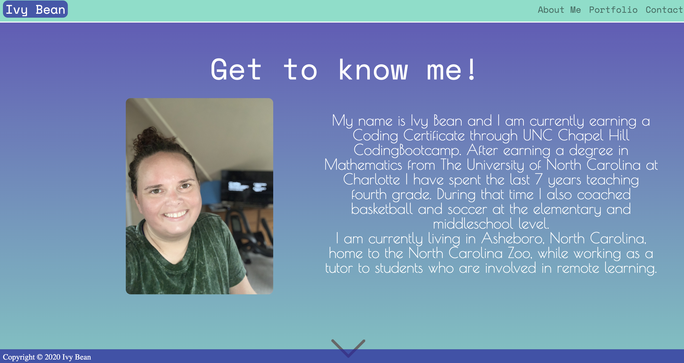
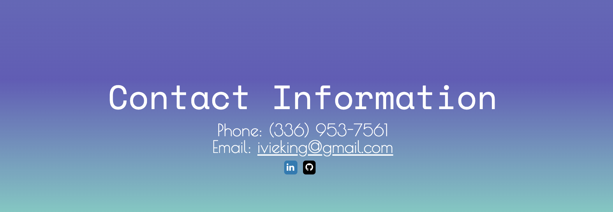

# ivybean.github.io
## Included Criteria

* semantic HTML elements
* responsive for all screen sizes
* Bootstrap components
* dynamically updated HTML and CSS used the Bootstrap CSS Framework to create a mobile responsive portfolio. 
This project includes a bio, a portfolio, and a contact page.

# Screenshots of Application

# Deployment

[link to deployment](https://ivybean.github.io/)